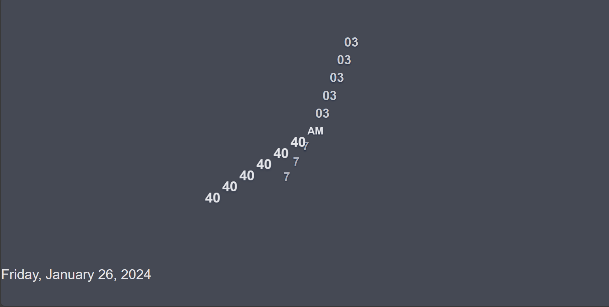

# Clock App

A simple clock application built with HTML, CSS, and JavaScript. It displays the current time with hour, minute, second, and AM/PM indicators. The clock also features a dark theme that adapts to the user's preferred color scheme.

##ScreenShot

## Features

- Real-time clock display with an animated second hand.
- Dark theme that toggles based on the user's preferred color scheme.
- Responsive design for a pleasant experience on various devices.

## How to Use

1. **Install Dependencies:**
   - Ensure you have Parcel installed globally. If not, install it by running:

     ```bash
     npm install -g parcel
     ```

2. **Clone the Repository:**
   - Clone the clock app repository:

     ```bash
     git clone https://github.com/yourusername/clock-app.git
     ```

3. **Navigate to the Project Directory:**
   - Change to the project directory:

     ```bash
     cd clock-app
     ```

4. **Install Project Dependencies:**
   - Install the required dependencies:

     ```bash
     npm install
     ```

5. **Run the Application:**
   - Start the application with Parcel:

     ```bash
     parcel index.html
     ```

   - Open your browser and go to [http://localhost:1234](http://localhost:1234) to view the clock.

## Clock Class

The Clock class provides the core functionality for the clock. It includes methods to update the time, animate the second hand, and handle date display.

## Dark Theme

The dark theme is applied automatically based on the user's preferred color scheme. Customize the color variables in the CSS to suit your preferences.

Feel free to integrate and customize this clock into your projects! If you have any suggestions or improvements, please open an issue or contribute to the repository.

## Acknowledgments

This project uses the "Lobster Two" font and is inspired by various clock designs on the web.
